## What is Software Testing ?? 

- **Software Testing**: Software testing is a process through which a software product or application is evaluated and verified to ensure it performs its intended functions correctly. It ensures the quality and functionality of the software according to user requirements and system specifications.

`সফটওয়্যার পরীক্ষণ হল একটি প্রক্রিয়া যার মাধ্যমে সফটওয়্যার পণ্য বা অ্যাপ্লিকেশনটি তার নির্ধারিত কাজগুলি সঠিকভাবে করছে কিনা তা মূল্যায়ন এবং যাচাই করা হয়। এটি ব্যবহারকারীর প্রয়োজনীয়তা এবং সিস্টেম স্পেসিফিকেশন অনুযায়ী সফটওয়্যারটির গুণমান এবং কার্যকারিতা নিশ্চিত করে ।`

## What is Software Validation??

- **Software Validation** : software validation is process of examining whether or not the software satisfies the users requirements. It caries out at the end of the SDLC. If the software matches requirements for which it was made, it is validated.

## Why need Validation??

- **Validation** ensures the product under development is as per the user requirements 
`Validation নিশ্চিত করে যে উন্নয়নাধীন পণ্যটি ব্যবহারকারীর প্রয়োজন অনুযায়ী তৈরি হচ্ছে।`

- **Validation** answer the question " Are we developing the product which attempts all this users need from this software?"
 
`Validation এই প্রশ্নের উত্তর দেয়, "আমরা কি এমন একটি পণ্য তৈরি করছি যা এই ব্যবহারকারীর সফটওয়্যার থেকে সকল প্রয়োজন পূরণ করার চেষ্টা করে?"`

- **Validation** emphasizes on the user requirements. 
`Validation ব্যবহারকারীর প্রয়োজনের ওপর গুরুত্ব দেয়।`

## What is Software Verification??

- **Software Verifications** : Software Verification  is the process of checking if the software meets business needs and follows the right rules and methods while being developed.

`software verifications: এটি একটি প্রক্রিয়া যেখানে দেখা হয় সফটওয়্যারটি ব্যবসার চাহিদা পূরণ করছে কিনা এবং সঠিক নিয়ম ও পদ্ধতি মেনে তৈরি করা হয়েছে কিনা।`

## Why need Software Verification?

- **Verification** makes sure that the product being made is built according to the design plans. 
` Verification নিশ্চিত করে যে পণ্যটি ডিজাইন পরিকল্পনা অনুযায়ী তৈরি হচ্ছে।`

- **Verification** answer the question "Are we building this product by carefully following all the design plans?" 
` verification এই প্রশ্নের উত্তর দেয়, "আমরা কি ডিজাইন পরিকল্পনা কঠোরভাবে মেনে এই পণ্যটি তৈরি করছি?"`

- **Verification**  focuses on checking the design and technical details of the system. 
` verification ডিজাইন এবং প্রযুক্তিগত বিশদগুলোর উপর বেশি জোর দেয়।`

## What is the target of the Software Verification test??

**The target of the software Verifications are --**

- **Errors** : These are mistakes made by developers while writing the code. When the software doesn’t give the expected result, it is considered an error. 
`ত্রুটি (Errors): এগুলি হল কোড লেখার সময় ডেভেলপারদের করা ভুল। যখন সফটওয়্যারটি প্রত্যাশিত ফলাফল দেয় না, তখন সেটিকে একটি ত্রুটি হিসেবে গণ্য করা হয়।`

- **Fault** : A fault, also called a bug, happens when an error is present. It can cause problems in the system or make it behave incorrectly. 
`ফল্ট (Fault): ফল্ট, যাকে বাগও বলা হয়, তখন ঘটে যখন একটি ত্রুটি বিদ্যমান থাকে। এটি সিস্টেমে সমস্যা সৃষ্টি করতে পারে বা সিস্টেমকে ভুলভাবে কাজ করতে বাধ্য করে।`

- **Failure** : Failure is when the system cannot do the task it’s supposed to. Failure happens when a fault exists in the system. 
`ব্যর্থতা (Failure): ব্যর্থতা হল যখন সিস্টেম তার নির্ধারিত কাজটি সম্পন্ন করতে ব্যর্থ হয়। ব্যর্থতা ঘটে যখন সিস্টেমে একটি ফল্ট বিদ্যমান থাকে।`

# Manual vs Automated Testing

**Testing can be done in two ways: manually or with the help of automated tools.**

- **Manual Testing**: In manual testing, the tester performs the tests without using any automation tools. The tester writes test cases for different parts of the software, runs the tests, and reports the results to the manager. Manual testing takes a lot of time and resources because the tester has to ensure the right test cases are used. Most of the testing is done manually. 

`ম্যানুয়াল টেস্টিং: ম্যানুয়াল টেস্টিং-এ পরীক্ষক কোনো স্বয়ংক্রিয় টুল ব্যবহার না করেই পরীক্ষাটি সম্পন্ন করে। পরীক্ষক সফটওয়্যারের বিভিন্ন অংশের জন্য টেস্ট কেস তৈরি করে, পরীক্ষাগুলি চালায় এবং ফলাফল ম্যানেজারকে জানায়। ম্যানুয়াল টেস্টিং সময়সাপেক্ষ এবং প্রচুর সম্পদ প্রয়োজন কারণ পরীক্ষককে নিশ্চিত করতে হয় যে সঠিক টেস্ট কেস ব্যবহার করা হচ্ছে কিনা। বেশিরভাগ পরীক্ষাই ম্যানুয়ালি করা হয়।`

- **Automated Testing**: Automated testing uses special tools to perform tests. These tools help overcome the limitations of manual testing. For example, if you need to test whether a webpage opens in Internet Explorer, you can easily do it manually. However, testing if a web server can handle 1 million users is nearly impossible to do manually. 

`স্বয়ংক্রিয় টেস্টিং: স্বয়ংক্রিয় টেস্টিং-এ পরীক্ষাগুলি সম্পন্ন করতে বিশেষ টুল ব্যবহার করা হয়। এই টুলগুলি ম্যানুয়াল টেস্টিংয়ের সীমাবদ্ধতাগুলি কাটিয়ে উঠতে সাহায্য করে। উদাহরণস্বরূপ, আপনি যদি যাচাই করতে চান যে একটি ওয়েবপেজ ইন্টারনেট এক্সপ্লোরারে খুলছে কিনা, এটি ম্যানুয়ালি সহজেই করা যায়। কিন্তু, ওয়েব সার্ভার ১০ লাখ ব্যবহারকারীর চাপ সামলাতে পারবে কিনা তা ম্যানুয়ালি পরীক্ষা করা প্রায় অসম্ভব।`

Automated tools are used for **load testing** (checking if the system can handle heavy use), **stress testing**, and **regression testing** (making sure new changes don’t break existing functionality). These tools make testing easier and faster. 

`লোড টেস্টিং (সিস্টেম ভারী ব্যবহার সামলাতে পারবে কিনা), স্ট্রেস টেস্টিং এবং রিগ্রেশন টেস্টিং (নতুন পরিবর্তনে আগের ফিচারগুলো ঠিকঠাক কাজ করছে কিনা) করার জন্য স্বয়ংক্রিয় টুলগুলি ব্যবহৃত হয়। এই টুলগুলি পরীক্ষার কাজকে আরও সহজ এবং দ্রুত করে তোলে।`

# Types of Software Test 

**Here the classification of the types of Software Test**

 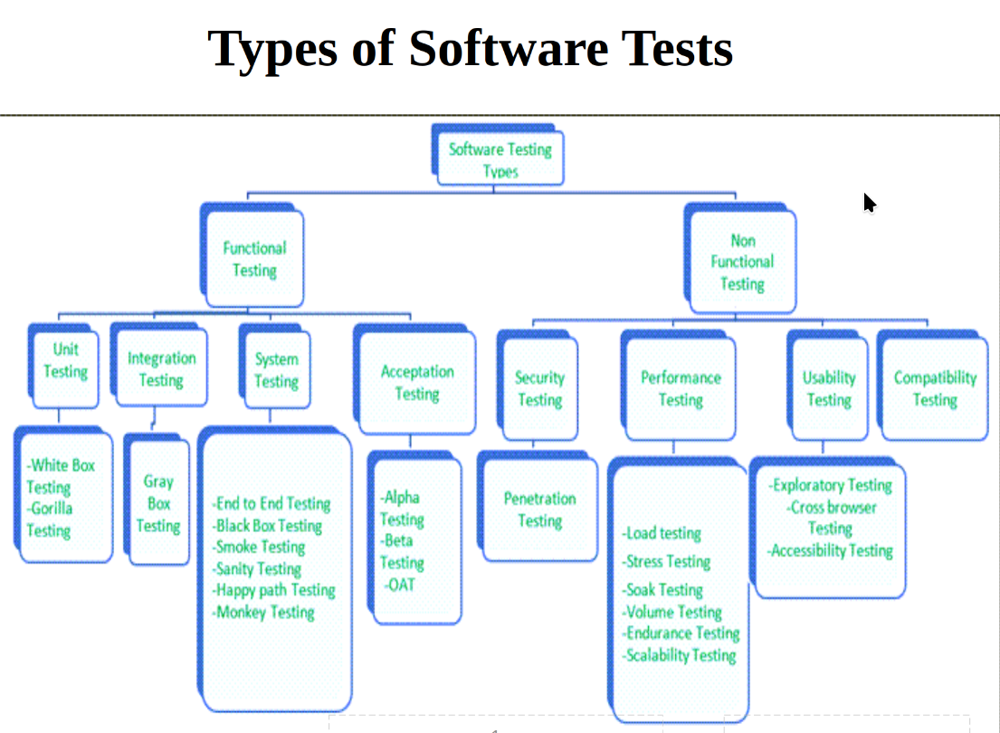

 

# List of Software Test

 ## Funtional Testing 

- Unit Testing (White Box)
- Integration Testing 
- Funtion Testing(Black Box)
- Regression Testing 
- System Testing 
- Acceptance and Installations Tests

## Non-Funtional Test

- Security Testing 
- Performance Testing 
- Usability Testing
- Compatibility Testing

# Unit Testing (White Box)

- White box testing is an approach that allows testers to inspect and verify the inner workings of a software system—its code, infrastructure, and integrations with external systems. 

`হোয়াইট বক্স টেস্টিং একটি পদ্ধতি যা পরীক্ষকদের সফটওয়্যার সিস্টেমের অভ্যন্তরীণ কাজকর্ম—এর কোড, অবকাঠামো এবং বাইরের সিস্টেমের সাথে সংযোগগুলো পরীক্ষা ও যাচাই করতে দেয়।`

- Individual components are tested. 
`পৃথক কম্পোনেন্টগুলো পরীক্ষা করা হয়।`

- It is a path test. 
`এটি একটি পথ ভিত্তিক পরীক্ষা।`

- To focus on a relatively small segment of code and aim to exercise a high percentage of the internal path.  
`কোডের একটি ছোট অংশের উপর ফোকাস করে এবং অভ্যন্তরীণ পথের একটি উচ্চ শতাংশ পরীক্ষা করার লক্ষ্যে কাজ করে।`

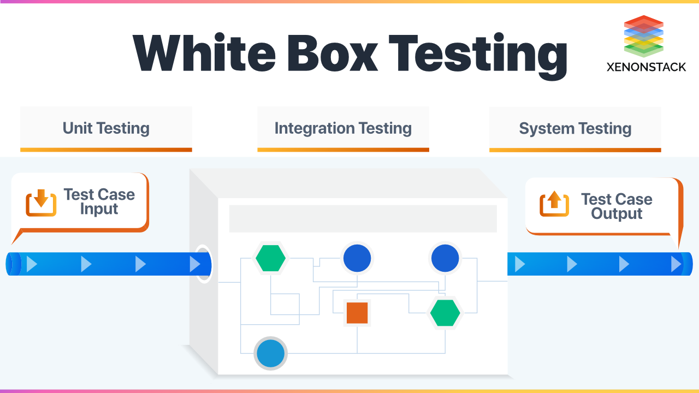 

# Advantages of Unit Testing(White Box Testing)

- **Better Quality and Performance**: Unit testing helps improve the quality of your code, making it easier to manage and reducing the chances of mistakes. 

`উচ্চতর গুণমান ও পারফরম্যান্স: ইউনিট টেস্টিং আপনার কোডের গুণমান উন্নত করতে সাহায্য করে, এটি পরিচালনা করা সহজ হয় এবং ভুলের সম্ভাবনা কমায়।`

- **Creates Documentation**: Unit tests can also serve as helpful guides or documentation for how parts of the code work. 
`ডকুমেন্টেশন তৈরি করে: ইউনিট টেস্টগুলি কোডের বিভিন্ন অংশ কীভাবে কাজ করে তার জন্য সহায়ক নির্দেশিকা বা ডকুমেন্টেশন হিসেবে কাজ করতে পারে।`

- **Finds Bugs**: It helps catch errors early before they become bigger problems. 
`বাগ খুঁজে বের করে: এটি ত্রুটিগুলি আগেই ধরে ফেলে, যাতে বড় সমস্যা না হয়।`

- **Easier to Fix Problems**: Unit testing makes it simpler to find and fix issues in the code. 
`সমস্যা সমাধান করা সহজ করে: ইউনিট টেস্টিং কোডের ত্রুটি খুঁজে বের করে ঠিক করা সহজ করে তোলে।`

- **Simplifies the Code**: It helps reduce the complexity of the software, making it easier to understand and work with. 
`কোড সরল করে: এটি সফটওয়্যারের জটিলতা কমাতে সাহায্য করে, ফলে কোডটি বুঝতে ও কাজ করতে সহজ হয়।` 

# Disadvantages of Unit Testing(White Box Testing)

- **More Code to Write**: With unit testing, you need to write extra code. For every part of your program, you often have to create one or more tests, which can be time-consuming if things are complicated. 
`বেশি কোড লিখতে হয়: ইউনিট টেস্টিং করার সময় আপনাকে অতিরিক্ত কোড লিখতে হয়। প্রোগ্রামের প্রতিটি অংশের জন্য এক বা একাধিক পরীক্ষা তৈরি করতে হয়, যা জটিল হলে সময়সাপেক্ষ হতে পারে।`

- **Not Good for Testing User Interfaces (UI)**: Unit tests work well for checking business logic but are not very useful for testing how the user interface works. 
`ইউজার ইন্টারফেস (UI) পরীক্ষায় ভালো নয়: ইউনিট টেস্টিং ব্যবসার লজিক চেক করার জন্য ভালো কাজ করে, কিন্তু ইউজার ইন্টারফেস (UI) কেমন কাজ করছে তা পরীক্ষা করার জন্য খুব কার্যকর নয়।`

- **Some Think It Makes Code Worse**: While some believe unit testing improves code quality, others argue that it can make the code more confusing and harder to navigate, especially when new changes are made. This can delay integration testing. 
`কিছু লোক মনে করে এটি কোডকে খারাপ করে তোলে: যদিও কেউ কেউ মনে করেন ইউনিট টেস্টিং কোডের গুণমান বাড়ায়, অন্যরা বলেন এটি কোডকে আরও বিভ্রান্তিকর এবং পরিচালনা করা কঠিন করে তোলে, বিশেষ করে যখন নতুন পরিবর্তন যুক্ত করা হয়। এটি ইন্টিগ্রেশন টেস্টিং শুরু করার আগে সময়ের অপচয় করে।`

- **Doesn't Catch All Errors**: Unit testing cannot find every error in a program. It can't test every possible scenario or spot problems with how different parts of the system work together. 
`সব ত্রুটি ধরতে পারে না: ইউনিট টেস্টিং একটি প্রোগ্রামের সব ত্রুটি খুঁজে পায় না। এটি প্রতিটি সম্ভাব্য পরিস্থিতি পরীক্ষা করতে পারে না এবং সিস্টেমের বিভিন্ন অংশ একসাথে কাজ করতে গিয়ে যে সমস্যা হয়, তা ধরতে পারে না।`

- **Tests Must Be Realistic**: For unit tests to be effective, the part you're testing must behave the same way it would in the full system. If it doesn’t, the test results may not be accurate or useful. 
`পরীক্ষাগুলি বাস্তবসম্মত হতে হবে: ইউনিট টেস্টিং তখনই কার্যকর হয় যখন আপনি যে অংশটি পরীক্ষা করছেন সেটি সম্পূর্ণ সিস্টেমের অংশ হিসেবে একইভাবে কাজ করে। যদি এটি না ঘটে, তবে পরীক্ষার ফলাফল সঠিক বা কার্যকর হবে না।` 

# Integration Testing

- **Integration testing** -- also known as integration and testing (I&T) -- is a type of software testing in which the different units, modules or components of a software application are tested as a combined entity.

**For example** the fuel system may be tested in collaboration with an exhaust system, and later, these two module's working is tested in collaboration with the working of an engine. Now, this is integration testing. 

`ইন্টিগ্রেশন টেস্টিং—যা ইন্টিগ্রেশন এবং টেস্টিং (I&T) নামেও পরিচিত—এক ধরনের সফটওয়্যার টেস্টিং যেখানে সফটওয়্যার অ্যাপ্লিকেশনের বিভিন্ন ইউনিট, মডিউল বা কম্পোনেন্টগুলোকে একটি সংযুক্ত সত্তা হিসেবে পরীক্ষা করা হয়।`

`উদাহরণস্বরূপ, ফুয়েল সিস্টেমকে এক্সহস্ট সিস্টেমের সাথে একত্রে পরীক্ষা করা যেতে পারে এবং পরে এই দুই মডিউলের কাজকে ইঞ্জিনের কাজের সাথে একত্রে পরীক্ষা করা হয়। এটিই ইন্টিগ্রেশন টেস্টিং।` 

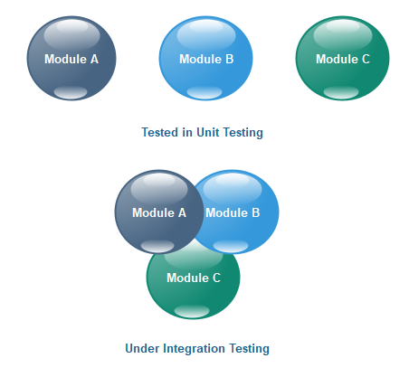 

# Types of Integration Testing

- Top-down Integration Test
- Bottom-up Integration Test
- Mixed/sandwich integration testing. 
- Big-bang integration testing.

## Top-Down Integration Test

- **Top-Down Integration** : Top down integration testing is a type of incremental testing where we move from top to down and keep integrating modules as we move ahead. 

To understand the concept of top down integration testing, we can construct a small example with familiar components used in a web application. 
`টপ-ডাউন ইন্টিগ্রেশন: টপ-ডাউন ইন্টিগ্রেশন টেস্টিং একটি ধাপে ধাপে পরীক্ষা করার পদ্ধতি, যেখানে আমরা উপরের দিক থেকে নিচের দিকে এগিয়ে যাই এবং পথের মধ্যে মডিউলগুলোকে একত্রিত করে পরীক্ষা করি।`

Let’s say we are constructing an application with two modules - a login page, a profile page, and a data record page where all the information regarding the user’s transaction can be seen.

On putting down the system's hierarchy, you may get the following result. 

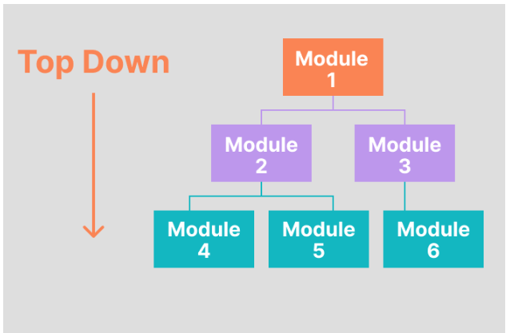 

In the top down integration testing approach, we first test the data records, then the data records integrated with Profile Page, and then all three.

To test the data records module, you need a few things from the Profile module, and to get Profile, you need credentials, and the login has been a success. This is achieved through stubs. You create stubs here with the login page module not directly interacting, but the modules above can get the correct response.

In practical situations, the module connections might not be this simple as they are shown here for demonstration purposes. However, the concepts and working conditions remain the same.

`টপ-ডাউন ইন্টিগ্রেশন টেস্টিংয়ের ধারণা বোঝার জন্য, আমরা একটি ছোট উদাহরণ তৈরি করতে পারি যা ওয়েব অ্যাপ্লিকেশনে ব্যবহৃত পরিচিত কম্পোনেন্টগুলোর উপর ভিত্তি করে।`

`ধরুন আমরা দুটি মডিউল নিয়ে একটি অ্যাপ্লিকেশন তৈরি করছি - একটি লগইন পেজ, একটি প্রোফাইল পেজ এবং একটি ডেটা রেকর্ড পেজ, যেখানে ব্যবহারকারীর সমস্ত লেনদেন সংক্রান্ত তথ্য দেখা যাবে।`

`সিস্টেমের শ্রেণীবিন্যাস সাজানোর পর আপনি নিম্নলিখিত ফলাফল পেতে পারেন।`

`টপ-ডাউন ইন্টিগ্রেশন টেস্টিং পদ্ধতিতে, প্রথমে আমরা ডেটা রেকর্ডস পরীক্ষা করি, তারপর ডেটা রেকর্ডসকে প্রোফাইল পেজের সাথে একত্রে পরীক্ষা করি, এবং শেষে এই তিনটি একত্রে পরীক্ষা করি।`

`ডেটা রেকর্ড মডিউল পরীক্ষা করার জন্য, প্রোফাইল মডিউল থেকে কিছু তথ্যের প্রয়োজন হয়, এবং প্রোফাইল পেতে, আপনার লগইন করতে হবে এবং লগইন সফল হওয়া প্রয়োজন। এটি স্টাব (stubs) ব্যবহার করে করা হয়। এখানে আপনি স্টাব তৈরি করেন যেখানে লগইন পেজ সরাসরি ইন্টারঅ্যাক্ট করে না, তবে উপরের মডিউলগুলো সঠিক প্রতিক্রিয়া পায়।`

`বাস্তব পরিস্থিতিতে, মডিউল সংযোগগুলো এখানে যেমন সহজভাবে দেখানো হয়েছে তেমন নাও হতে পারে। তবে ধারণা এবং কাজের অবস্থা একই থাকে।` 

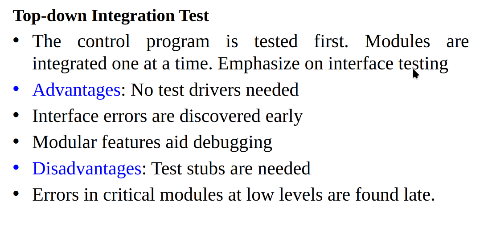 

## Bottom-up Integration Test

- Allow early testing aimed at proving feasibility Emphasize on module functionality and performance. 
`প্রাথমিক পরীক্ষার সুযোগ দেয় যা কার্যকারিতা প্রমাণ করার উদ্দেশ্যে করা হয়। মডিউলের কার্যকারিতা এবং পারফরম্যান্সের উপর জোর দেয়।`
	
**Advantages**: 

- No test stubs are needed 
`টেস্ট স্টাব প্রয়োজন হয় না।`

- Errors in critical modules are found early 
`গুরুত্বপূর্ণ মডিউলগুলোর ত্রুটি আগে থেকেই খুঁজে পাওয়া যায়।`

**Disadvantages**: 

- Test drivers are needed 
`টেস্ট ড্রাইভার প্রয়োজন হয়।`

- Interface errors are discovered late 
`ইন্টারফেস ত্রুটিগুলি দেরিতে আবিষ্কৃত হয়।` 

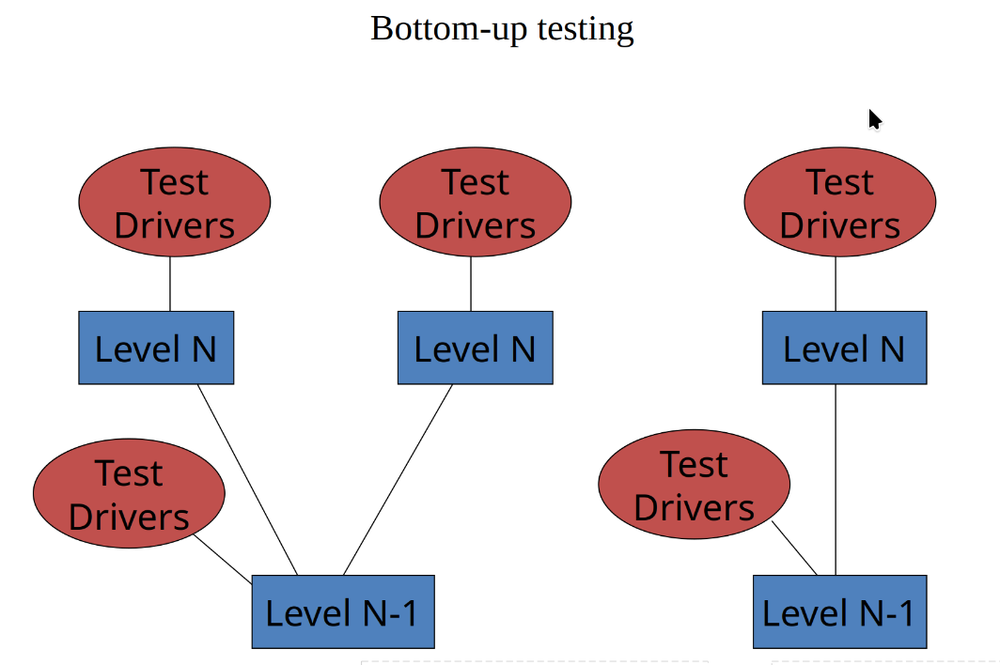 

## Big Bang Integration Test

- **Big bang integration** : Big bang integration testing is a testing approach where all components or modules are integrated and tested as a single unit. This is done after all modules have been completed and before any system-level testing is performed. 

 

## Advantages of Big Bang Integration:

-  Big bang integration testing allows for testing of complex interactions between components.
-  This is beneficial as it allows for the identification of errors that may not be detected by other testing methods.

## Disadvantages of Big Bang Integration:

- In general it is very time consuming.
-  It can be difficult to identify and fix errors that are discovered late in the testing process.

# Black Box /System /Function  Testing

- **Black Box Testing** : Black box testing is a software testing methodology in which the tester analyzes the functionality of an application without a thorough knowledge of its internal design.

## Example: 

- we all have tried Black Box testing in our lives. For example, while pressing the start button of a bike, we expect it to start without getting into its inner working mechanism. In other words, it focuses on the functionality of the software without any need for coding knowledge. 

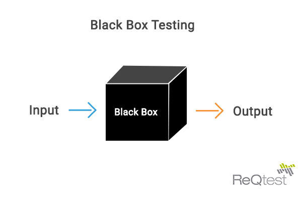 

## Advantage of Black Box Testing :

- Well suited and efficient for large code segments.
- Code access is not required.
- Clearly separates user's perspective from the developer's perspective through visibly defined roles
- Large numbers of moderately skilled testers can test the application with no knowledge of implementation, programming     language, or operating systems.
## Disadvantage of Black Box Testing : 
- Limited coverage, since only a selected number of test scenarios is actually performed.
- Inefficient testing, due to the fact that the tester only has limited knowledge about an application.
- Blind coverage
- The test cases are difficult to design.  

# Regression Testing

- **Regression Testing** : Regression testing is testing existing software applications to make sure that a change or addition hasn't broken any existing functionality.

**Example** :, these code changes could include adding new features, fixing bugs, or updating a current feature.  

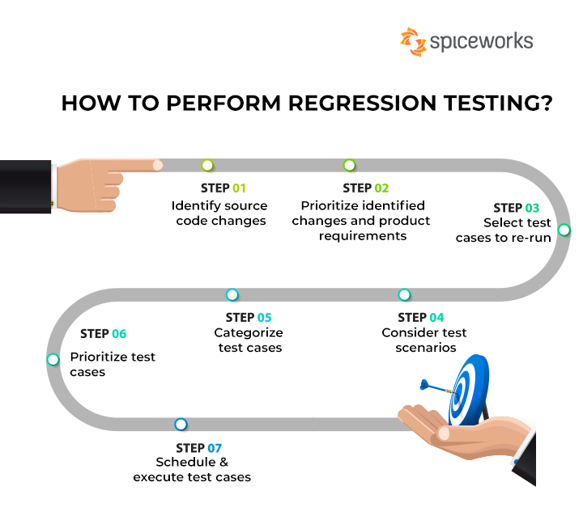 

# Acceptance Testing 

- **Acceptance Testing** : Acceptance testing is a quality assurance (QA) process that determines to what degree an application meets end users' approval. Depending on the organization, acceptance testing might take the form of beta testing, application testing, field testing or end-user testing. 

**Example**: 
Alpha and beta testing are examples of acceptance testing. Alpha tests are internal and aim to spot any glaring defects, while beta testing is an external pilot-test of a product before it goes into commercial production.

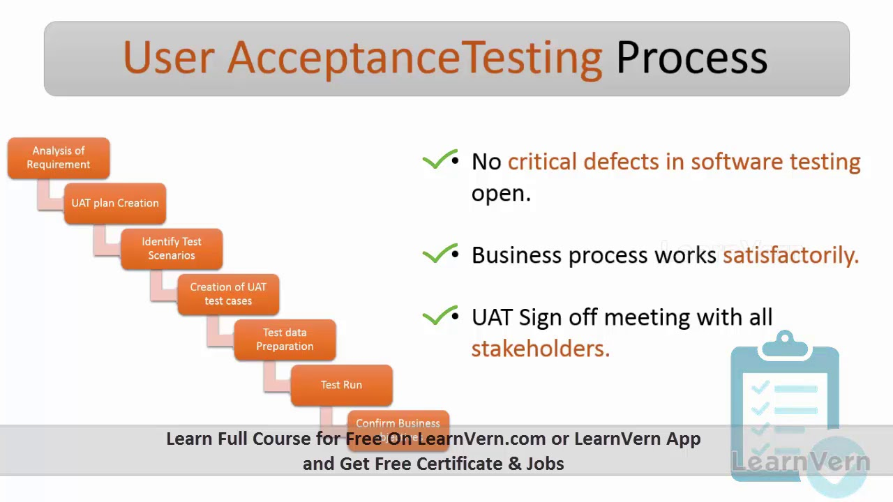 

# Sequrity Testing 

- **Software Sequrity Testing** : Software security testing is a software testing process that ensures the software is free of any potential vulnerabilities or weaknesses, risks, or threats so that the software might not harm the user system and data. 

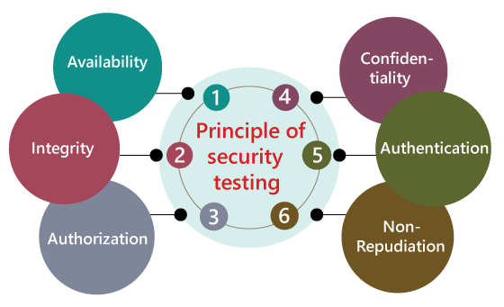 

## Principle of Sequrity Testing

- **Availability**: This ensures that only authorized people can access the data, and that the data and services will always be available whenever needed.

- **Integrity**: This protects the data from being changed by unauthorized people. Its goal is to make sure that the information you receive or send is accurate and hasn't been tampered with.

- **Authorization**: This checks if a person has the right permission to access or modify specific data or services.

- **Confidentiality**: This ensures that sensitive information is protected from being leaked to people who shouldn't have access to it.

- **Authentication**: This process verifies that a person is who they say they are before they are given access to the system.

- **Non-repudiation**: This guarantees that a message was truly sent and received by the people who claim to have sent and received it. It prevents anyone from denying that they participated in the communication. 

# Performance Testing 

- **Performance Test** : Performance testing is a non-functional software testing technique that determines how the stability, speed, scalability, and responsiveness of an application holds up under a given workload. 

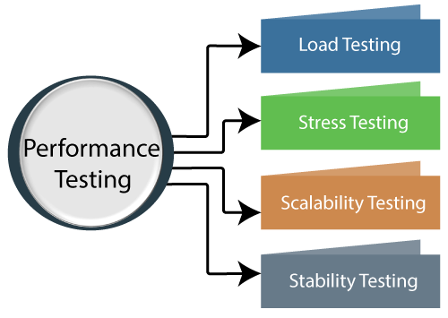 

## Benefits of Performance Testing
  - Validate the fundamental features of the software. 
  - Measure the speed, accuracy and stability of software. 
  - Performance testing allows you to keep your users happy.
  - Identify discrepancies and resolve issues.
  - Improve optimization and load capability.

  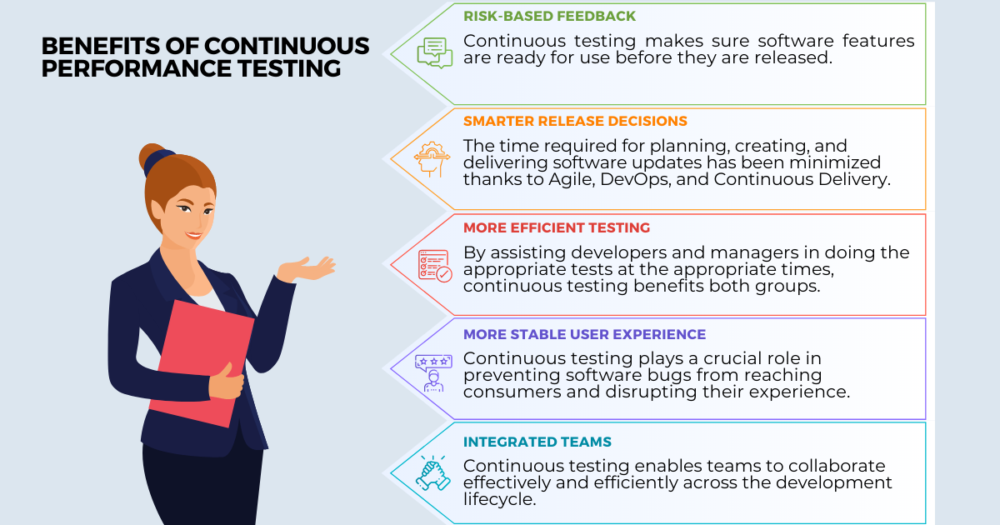 
 