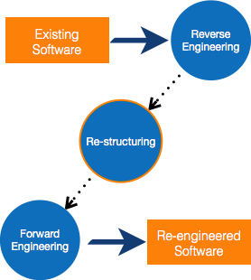
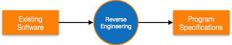
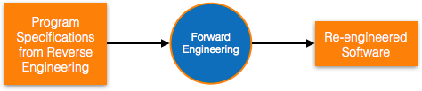
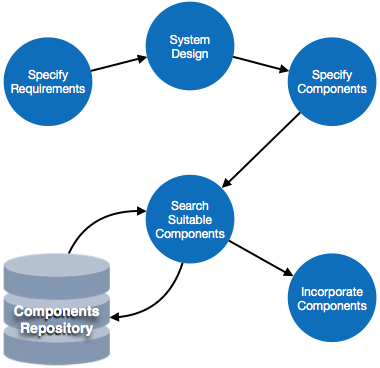

# Software Re-Engineering 

- **software Re-engineering**: When we need to update software to match current market needs without changing how it works,
 it is called **software re-engineering.** 

This is a big process where the design of the software is changed, and the code is re-written.

Old software, known as legacy software, often cannot keep up with new technology. As old hardware becomes outdated, updating the software can become difficult. Even though software may become old, its functions often still work well.

**For example**, Unix was first made using assembly language, but when the C programming language was created, Unix was re-engineered in C because using assembly was too hard.

 

Sometimes, programmers also see that certain parts of software need more maintenance, so those parts may also need re-engineering. 

# Re-Engineering Process

- **Decide** what to re-engineer. Is it whole software or a part of it?
- **Perform Reverse Engineering**, in order to obtain specifications of existing software.
- **Restructure Program** if required. For example, changing function-oriented programs into object-oriented programs.
- **Re-structure data** as required.
- **Apply Forward engineering** concepts in order to get re-engineered software.

There are few important terms used in Software re-engineering 

# Reverse Engineering : 

**Reverse engineering** is the process of understanding how a system works by carefully studying an existing system. It’s like working backwards through the steps of creating software.

 

When we have a system but don’t know how it was made, we look at the code to figure out the design. From the design, we try to understand the system's requirements and how it was supposed to work. So, we start from the code and work backwards to understand the system’s design and details.

# Program Restructuring 

**Program restructuring** is the process of reorganizing the code of existing software. This can involve rearranging the code in the same programming language or changing it to a different one.

Restructuring doesn’t change how the software works but makes it more reliable and easier to maintain. For example, we can fix parts of the software that often cause errors.

**Example:** If a program is in an old language like COBOL, we might restructure it by rewriting it in a newer language like Java to make it easier to work with, without changing what the program does. 

# Forward Engineering

**Forward engineering** is a process of obtaining desired software from the specifications in hand which were brought down by means of reverse engineering. It assumes that there was some software engineering already done in the past.

Forward engineering is same as software engineering process with only one difference – it is carried out always after reverse engineering.

 

# Component Reusability

**Component reusability** means using parts of software code again in different programs. A component is a piece of code that does a specific task on its own, like a small module.

**Example:**

- A login system on a website is a component that can be used in different applications.
- The printing function in software is another example of a reusable component.

**Components** are designed to work independently, which means they can do their jobs without needing help from other parts of the software.

**In Object-Oriented Programming (OOP)**, objects are often made for specific tasks and may not be easily reused. However, in modular programming, modules are created to do specific tasks and can be used in many different programs.

There is a whole area called **Component-Based Software Engineering (CBSE)** that focuses on reusing these software components to save time and effort.

 

# Various levels of Re-Use

## Re-use can be done at various levels

- **Application level** - Where an entire application is used as sub-system of new software.
- **Component level** - Where sub-system of an application is used.
- **Modules level** - Where functional modules are re-used.
Software components provide interfaces, which can be used to establish communication among different components.

# Re-Use Process 

The reuse process involves two main methods: either keeping the requirements the same and adjusting the components or keeping the components the same and changing the requirements.

 

- **Requirement Specification** – Define what the software needs to do, both functional (what it should do) and non-functional (how well it should perform). This is done using existing systems and user feedback.

- **Design** – Create a basic plan for the entire system and its smaller parts, defining how everything will work together.

- **Specify Components** – Break the system down into smaller parts or components. This way, one big software design becomes a collection of many working pieces.

- **Search Suitable Components** – Look for existing components in a repository (a library of software parts) that match the needs of the software based on their functions.

- **Incorporate Components** – Combine all the matched components to create the complete software product.
